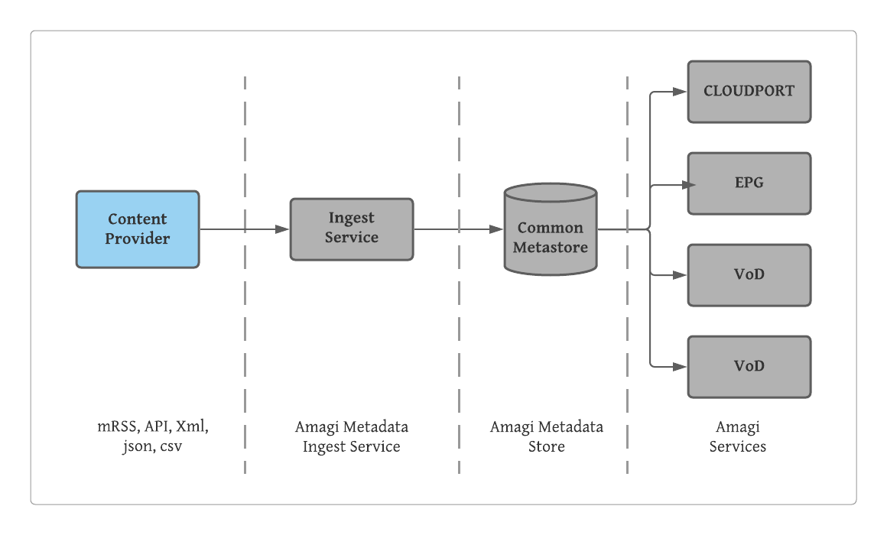

## What is metadata?

Metadata represents data that describes a media content, specifically video content in Amagi services. The metadata varies in depth, and it could be one of the following as provided below, but not necessarily confining to these details:-

* Title of a content

* Information required for EPG (Electronic Programming Guide)

* Information required for delivering content for Video on Demand

## How is metadata used by Amagi services?

| Amagi Service | Service Description | Metadata | Remarks |
|----------------|----------------|----------------|----------------|
| CLOUDPORT | Linear Channel Playout | Title |  |
|   |   | Segments | Segements |
|   |   | Media Type | Types - program, movie, promo |
|   |   | V-Chip |  |
|   |   | AFD | Active Field Descriptor |
| EPG | Electronic Programming Guide | Used for delivering EPG to MVPD platforms | As per EPG specification from MVPD  |
| VoD | Video on Demand Delivery | Used for delivering VoD contents to MVPD platforms | As per requirements for VoD Delivery  |
| Analytics | Analytics | Title |  |
|   |   | Content Id | External Content Id |

## Metadata and Amagi Services

Content provider ingest metadata to Amagi metadata store using [Metadata Ingest Service](ingest). The metadata is stored and maintained in a common metastore, and various Amagi sevices use metadata from the common store.

## How is metadata ingested to Amagi services?

There are different methods to ingest metadata to Amagi Services. These are broadly classified into **Push** and **Pull** methods. The different ways to ingest metadata using these methods are described in [**Metadata Ingest Methods**](ingest).

## What are the supported formats for ingesting to Amagi services?

The metadata service supports different formats for ingesting to Amagi services. The following links provides a brief description about the formats and links to the sample formats.
  
  * [**Supported Formats**](formats)
  
  * [**Sample Formats**](sampleformats)
